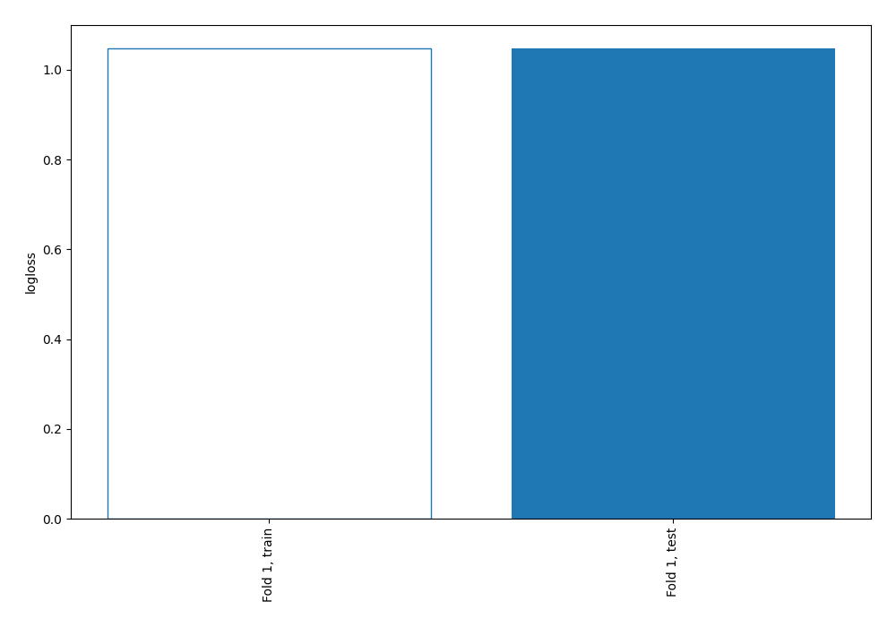
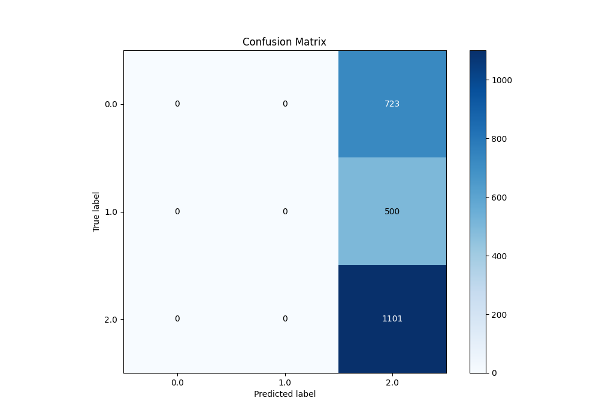
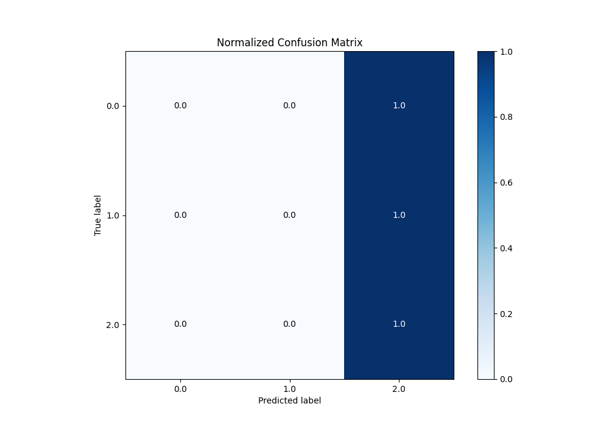
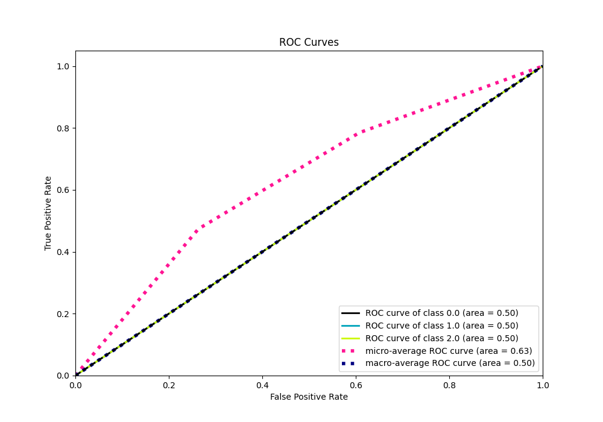
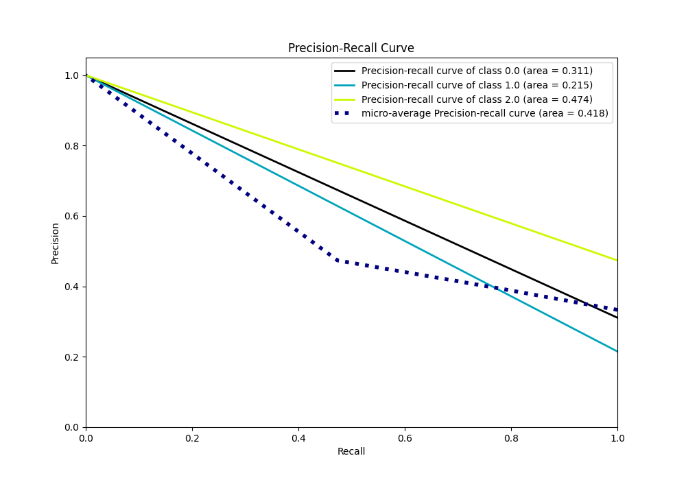

# Summary of 1_Baseline

[<< Go back](../README.md)

## Baseline Classifier (Baseline)
- **n_jobs**: -1
- **num_class**: 3
- **explain_level**: 2

## Validation
 - **validation_type**: split
 - **train_ratio**: 0.75
 - **shuffle**: True
 - **stratify**: True

## Optimized metric
logloss

## Training time

0.3 seconds

### Metric details
|           |   0.0 |   1.0 |         2.0 |   accuracy |   macro avg |   weighted avg |   logloss |
|:----------|------:|------:|------------:|-----------:|------------:|---------------:|----------:|
| precision |     0 |     0 |    0.473752 |   0.473752 |    0.157917 |       0.224441 |   1.04774 |
| recall    |     0 |     0 |    1        |   0.473752 |    0.333333 |       0.473752 |   1.04774 |
| f1-score  |     0 |     0 |    0.64292  |   0.473752 |    0.214307 |       0.304585 |   1.04774 |
| support   |   723 |   500 | 1101        |   0.473752 | 2324        |    2324        |   1.04774 |

## Confusion matrix
|                |   Predicted as 0.0 |   Predicted as 1.0 |   Predicted as 2.0 |
|:---------------|-------------------:|-------------------:|-------------------:|
| Labeled as 0.0 |                  0 |                  0 |                723 |
| Labeled as 1.0 |                  0 |                  0 |                500 |
| Labeled as 2.0 |                  0 |                  0 |               1101 |

## Learning curves

## Confusion Matrix

## Normalized Confusion Matrix

## ROC Curve

## Precision Recall Curve

[<< Go back](../README.md)
