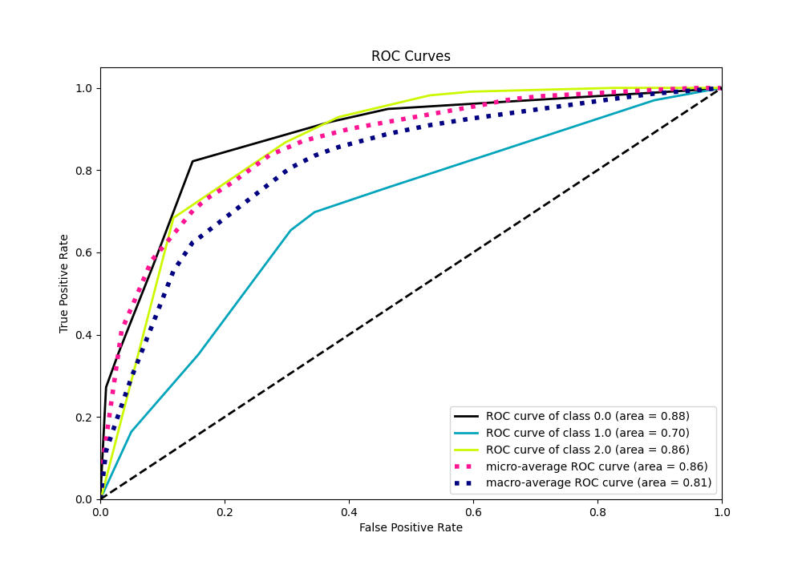
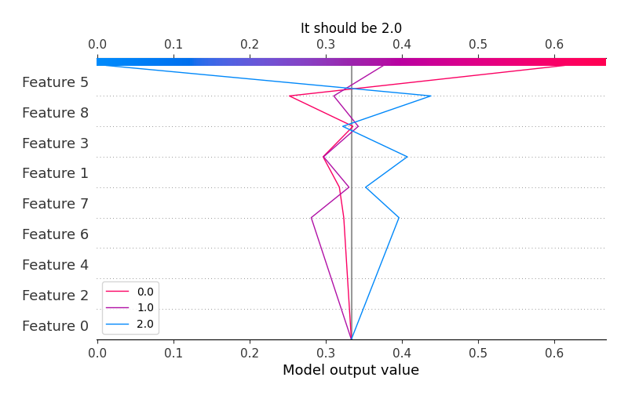

# Summary of 2_DecisionTree

[<< Go back](../README.md)

## Decision Tree
- **n_jobs**: -1
- **criterion**: gini
- **max_depth**: 3
- **num_class**: 3
- **explain_level**: 2

## Validation
 - **validation_type**: split
 - **train_ratio**: 0.75
 - **shuffle**: True
 - **stratify**: True

## Optimized metric
logloss

## Training time

13.4 seconds

### Metric details
|           |        0.0 |        1.0 |         2.0 |   accuracy |   macro avg |   weighted avg |   logloss |
|:----------|-----------:|-----------:|------------:|-----------:|------------:|---------------:|----------:|
| precision |   0.713942 |   0.473988 |    0.724033 |   0.701807 |    0.637321 |       0.667098 |  0.717406 |
| recall    |   0.821577 |   0.164    |    0.867393 |   0.701807 |    0.617657 |       0.701807 |  0.717406 |
| f1-score  |   0.763987 |   0.243685 |    0.789256 |   0.701807 |    0.598976 |       0.664017 |  0.717406 |
| support   | 723        | 500        | 1101        |   0.701807 | 2324        |    2324        |  0.717406 |

## Confusion matrix
|                |   Predicted as 0.0 |   Predicted as 1.0 |   Predicted as 2.0 |
|:---------------|-------------------:|-------------------:|-------------------:|
| Labeled as 0.0 |                594 |                 23 |                106 |
| Labeled as 1.0 |                160 |                 82 |                258 |
| Labeled as 2.0 |                 78 |                 68 |                955 |

## Learning curves

## Permutation-based Importance

## Confusion Matrix

## Normalized Confusion Matrix

## ROC Curve

## Precision Recall Curve

## SHAP Importance

## SHAP Dependence plots

### Dependence 0.0 (Fold 1)

### Dependence 1.0 (Fold 1)

### Dependence 2.0 (Fold 1)

## SHAP Decision plots

### Worst decisions for selected sample 1 (Fold 1)

### Worst decisions for selected sample 2 (Fold 1)

### Worst decisions for selected sample 3 (Fold 1)

### Worst decisions for selected sample 4 (Fold 1)

### Best decisions for selected sample 1 (Fold 1)

### Best decisions for selected sample 2 (Fold 1)

### Best decisions for selected sample 3 (Fold 1)

### Best decisions for selected sample 4 (Fold 1)

[<< Go back](../README.md)
