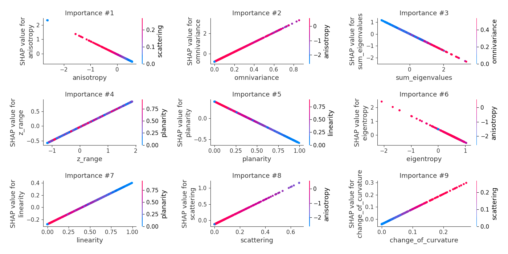

# Summary of 3_Linear

[<< Go back](../README.md)

## Logistic Regression (Linear)
- **n_jobs**: -1
- **num_class**: 3
- **explain_level**: 2

## Validation
 - **validation_type**: split
 - **train_ratio**: 0.75
 - **shuffle**: True
 - **stratify**: True

## Optimized metric
logloss

## Training time

5.8 seconds

### Metric details
|           |        0.0 |        1.0 |         2.0 |   accuracy |   macro avg |   weighted avg |   logloss |
|:----------|-----------:|-----------:|------------:|-----------:|------------:|---------------:|----------:|
| precision |   0.72795  |   0.496296 |    0.721821 |   0.710843 |    0.648689 |       0.675207 |   0.66465 |
| recall    |   0.810512 |   0.134    |    0.907357 |   0.710843 |    0.61729  |       0.710843 |   0.66465 |
| f1-score  |   0.767016 |   0.211024 |    0.804024 |   0.710843 |    0.594021 |       0.664929 |   0.66465 |
| support   | 723        | 500        | 1101        |   0.710843 | 2324        |    2324        |   0.66465 |

## Confusion matrix
|                |   Predicted as 0.0 |   Predicted as 1.0 |   Predicted as 2.0 |
|:---------------|-------------------:|-------------------:|-------------------:|
| Labeled as 0.0 |                586 |                 37 |                100 |
| Labeled as 1.0 |                148 |                 67 |                285 |
| Labeled as 2.0 |                 71 |                 31 |                999 |

## Learning curves

## Coefficients

### Coefficients learner #1
|                     |       0.0 |         1.0 |        2.0 |
|:--------------------|----------:|------------:|-----------:|
| intercept           | -0.547598 |  1.11047    | -0.562871  |
| linearity           |  0.682165 |  0.02244    | -0.704605  |
| planarity           | -0.975844 | -0.235586   |  1.21143   |
| scattering          |  1.90577  | -1.93772    |  0.0319515 |
| omnivariance        |  4.77861  | -4.61341    | -0.1652    |
| sum_eigenvalues     | -0.699499 |  0.340666   |  0.358833  |
| anisotropy          | -0.911373 | -0.712546   |  1.62392   |
| eigentropy          | -0.952614 | -0.00690191 |  0.959515  |
| change_of_curvature |  1.23884  | -2.15596    |  0.917123  |
| z_range             |  0.464165 |  0.417537   | -0.881703  |

## Permutation-based Importance

## Confusion Matrix

## Normalized Confusion Matrix

## ROC Curve

## Precision Recall Curve

## SHAP Importance

## SHAP Dependence plots

### Dependence 0.0 (Fold 1)

### Dependence 1.0 (Fold 1)

### Dependence 2.0 (Fold 1)

## SHAP Decision plots

### Worst decisions for selected sample 1 (Fold 1)

### Worst decisions for selected sample 2 (Fold 1)

### Worst decisions for selected sample 3 (Fold 1)

### Worst decisions for selected sample 4 (Fold 1)

### Best decisions for selected sample 1 (Fold 1)

### Best decisions for selected sample 2 (Fold 1)

### Best decisions for selected sample 3 (Fold 1)

### Best decisions for selected sample 4 (Fold 1)

[<< Go back](../README.md)
