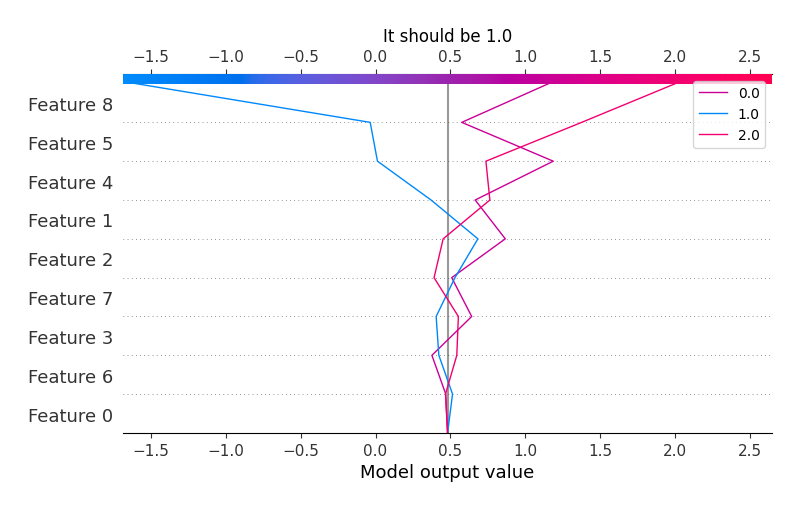

# Summary of 4_Default_Xgboost

[<< Go back](../README.md)

## Extreme Gradient Boosting (Xgboost)
- **n_jobs**: -1
- **objective**: multi:softprob
- **eta**: 0.075
- **max_depth**: 6
- **min_child_weight**: 1
- **subsample**: 1.0
- **colsample_bytree**: 1.0
- **eval_metric**: mlogloss
- **num_class**: 3
- **explain_level**: 2

## Validation
 - **validation_type**: split
 - **train_ratio**: 0.75
 - **shuffle**: True
 - **stratify**: True

## Optimized metric
logloss

## Training time

9.7 seconds

### Metric details
|           |        0.0 |        1.0 |         2.0 |   accuracy |   macro avg |   weighted avg |   logloss |
|:----------|-----------:|-----------:|------------:|-----------:|------------:|---------------:|----------:|
| precision |   0.74012  |   0.696751 |    0.821782 |   0.777539 |    0.752884 |       0.769477 |   0.54118 |
| recall    |   0.854772 |   0.386    |    0.904632 |   0.777539 |    0.715135 |       0.777539 |   0.54118 |
| f1-score  |   0.793325 |   0.496782 |    0.861219 |   0.777539 |    0.717109 |       0.76169  |   0.54118 |
| support   | 723        | 500        | 1101        |   0.777539 | 2324        |    2324        |   0.54118 |

## Confusion matrix
|                |   Predicted as 0.0 |   Predicted as 1.0 |   Predicted as 2.0 |
|:---------------|-------------------:|-------------------:|-------------------:|
| Labeled as 0.0 |                618 |                 33 |                 72 |
| Labeled as 1.0 |                163 |                193 |                144 |
| Labeled as 2.0 |                 54 |                 51 |                996 |

## Learning curves

## Permutation-based Importance

## Confusion Matrix

## Normalized Confusion Matrix

## ROC Curve

## Precision Recall Curve

## SHAP Importance

## SHAP Dependence plots

### Dependence 0.0 (Fold 1)

### Dependence 1.0 (Fold 1)

### Dependence 2.0 (Fold 1)

## SHAP Decision plots

### Worst decisions for selected sample 1 (Fold 1)

### Worst decisions for selected sample 2 (Fold 1)

### Worst decisions for selected sample 3 (Fold 1)

### Worst decisions for selected sample 4 (Fold 1)

### Best decisions for selected sample 1 (Fold 1)

### Best decisions for selected sample 2 (Fold 1)

### Best decisions for selected sample 3 (Fold 1)

### Best decisions for selected sample 4 (Fold 1)

[<< Go back](../README.md)
