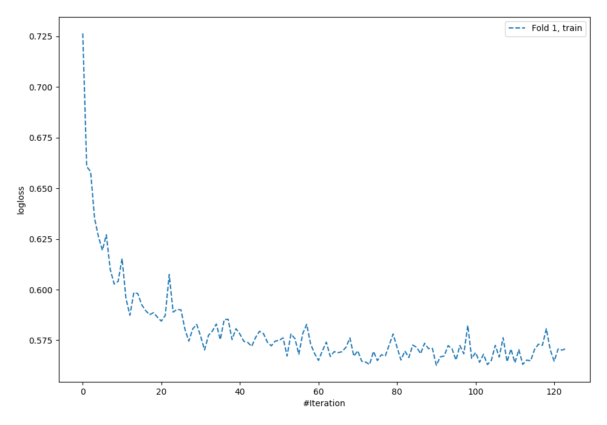
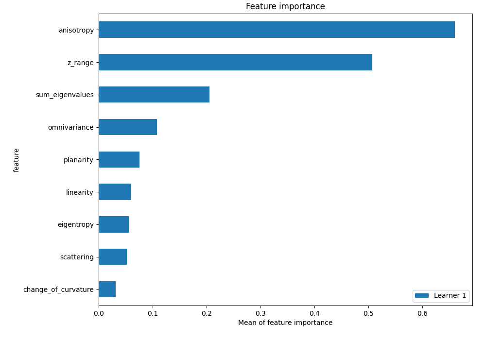
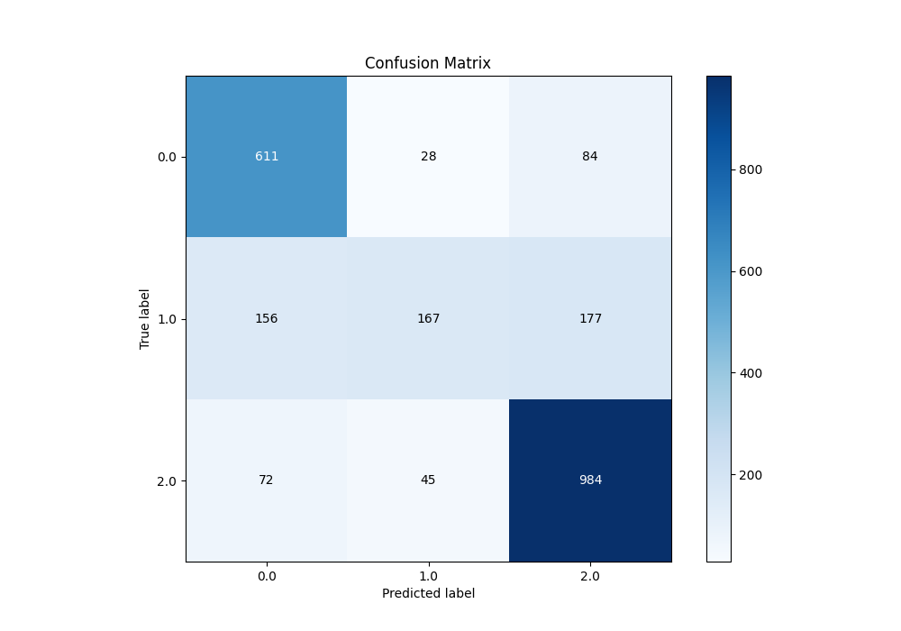
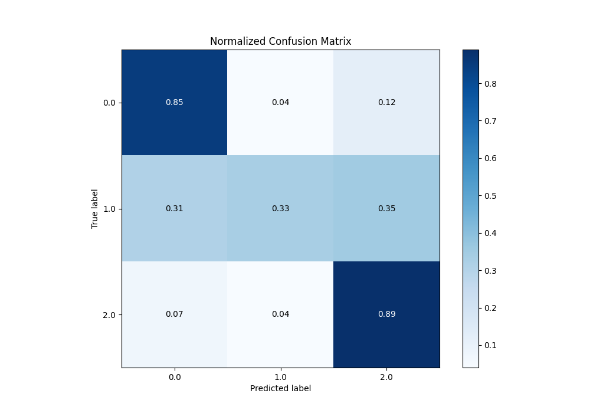
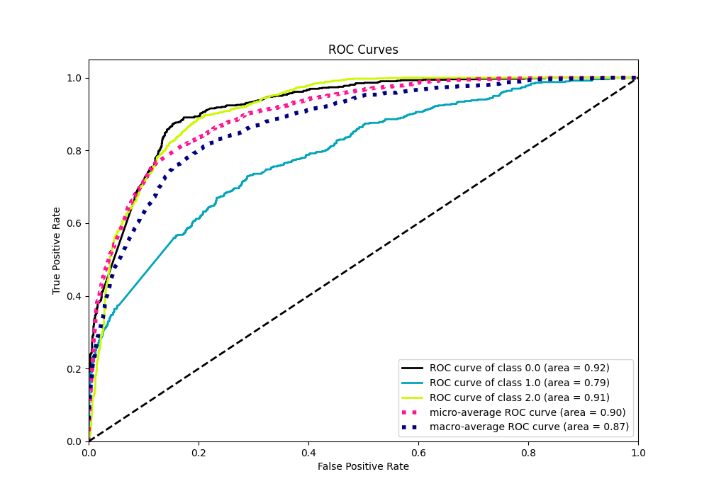
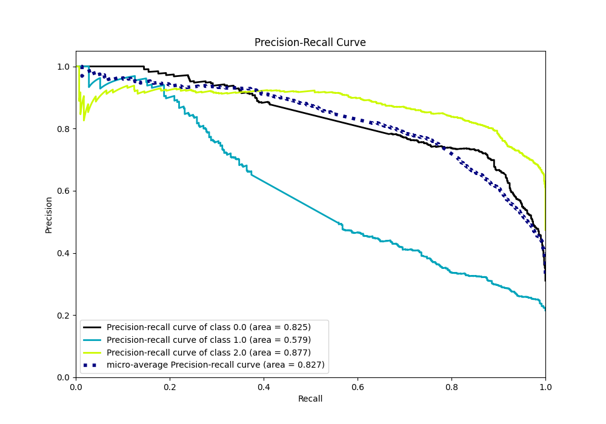

# Summary of 5_Default_NeuralNetwork

[<< Go back](../README.md)

## Neural Network
- **n_jobs**: -1
- **dense_1_size**: 32
- **dense_2_size**: 16
- **learning_rate**: 0.05
- **num_class**: 3
- **explain_level**: 2

## Validation
 - **validation_type**: split
 - **train_ratio**: 0.75
 - **shuffle**: True
 - **stratify**: True

## Optimized metric
logloss

## Training time

2.2 seconds

### Metric details
|           |        0.0 |        1.0 |         2.0 |   accuracy |   macro avg |   weighted avg |   logloss |
|:----------|-----------:|-----------:|------------:|-----------:|------------:|---------------:|----------:|
| precision |   0.728248 |   0.695833 |    0.790361 |   0.758176 |    0.738148 |       0.7507   |  0.595645 |
| recall    |   0.84509  |   0.334    |    0.893733 |   0.758176 |    0.690941 |       0.758176 |  0.595645 |
| f1-score  |   0.78233  |   0.451351 |    0.838875 |   0.758176 |    0.690852 |       0.737909 |  0.595645 |
| support   | 723        | 500        | 1101        |   0.758176 | 2324        |    2324        |  0.595645 |

## Confusion matrix
|                |   Predicted as 0.0 |   Predicted as 1.0 |   Predicted as 2.0 |
|:---------------|-------------------:|-------------------:|-------------------:|
| Labeled as 0.0 |                611 |                 28 |                 84 |
| Labeled as 1.0 |                156 |                167 |                177 |
| Labeled as 2.0 |                 72 |                 45 |                984 |

## Learning curves

## Permutation-based Importance

## Confusion Matrix

## Normalized Confusion Matrix

## ROC Curve

## Precision Recall Curve

[<< Go back](../README.md)
