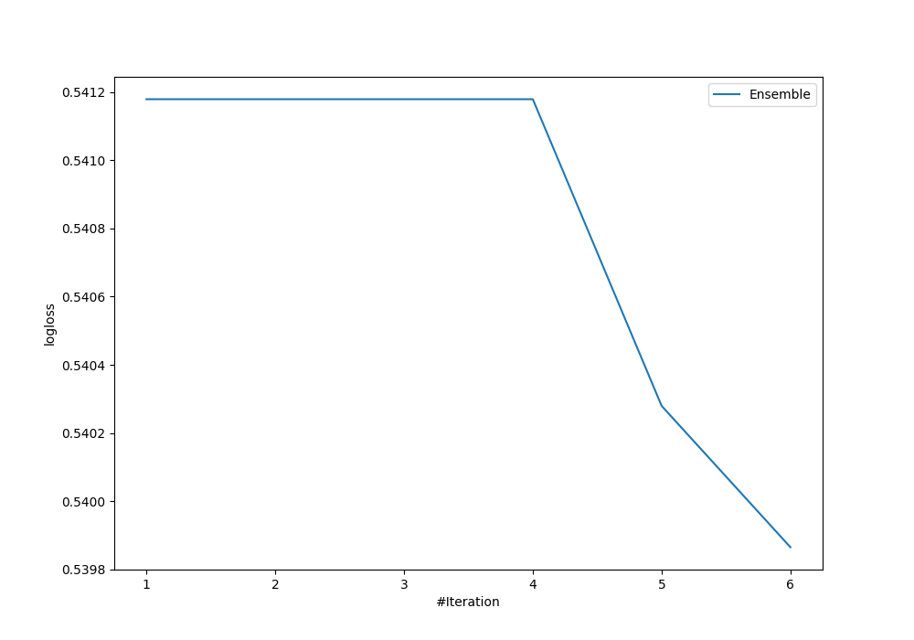
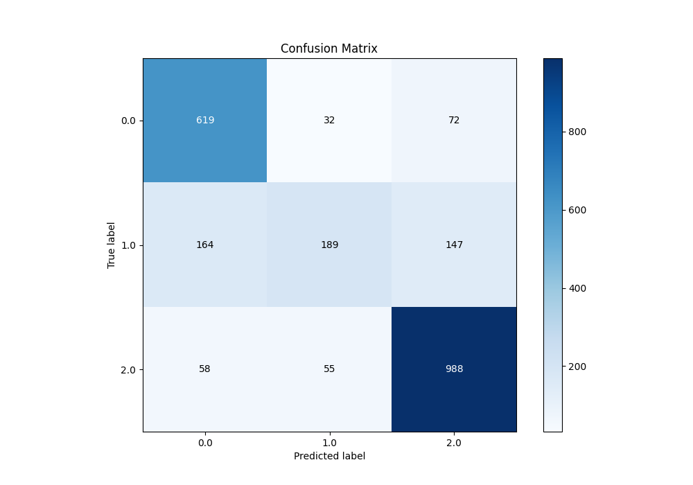
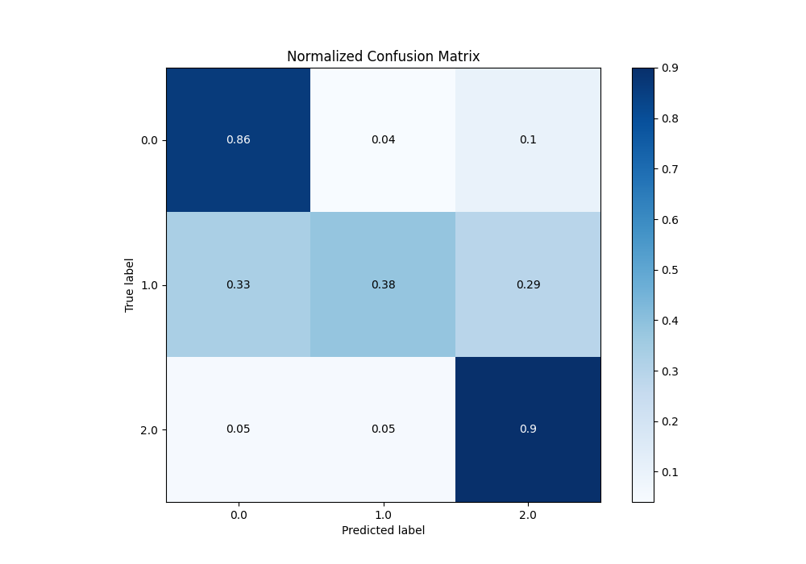
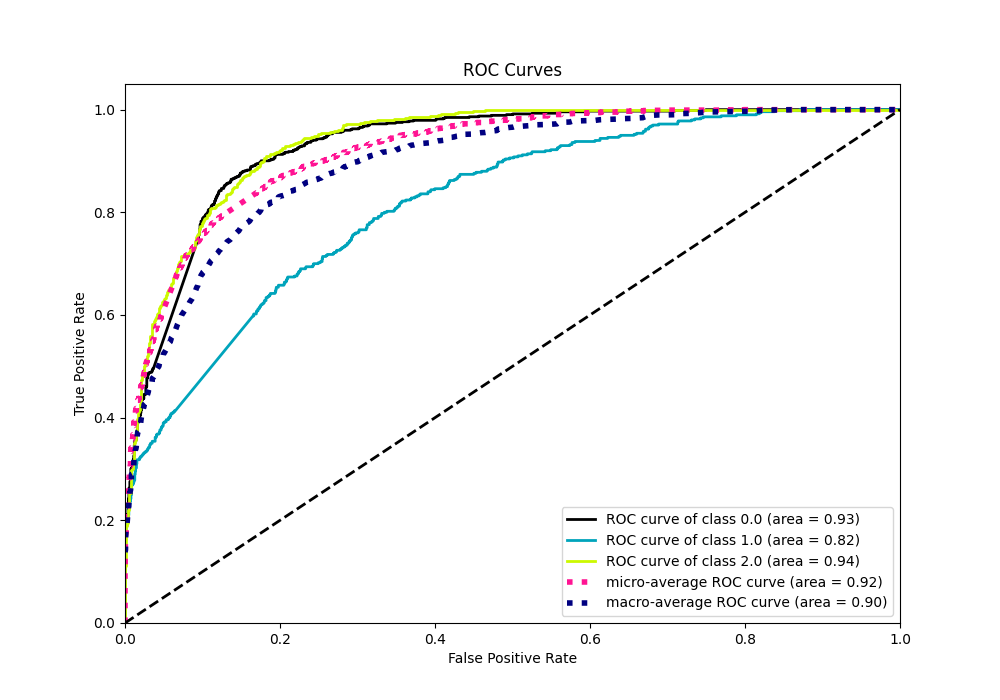
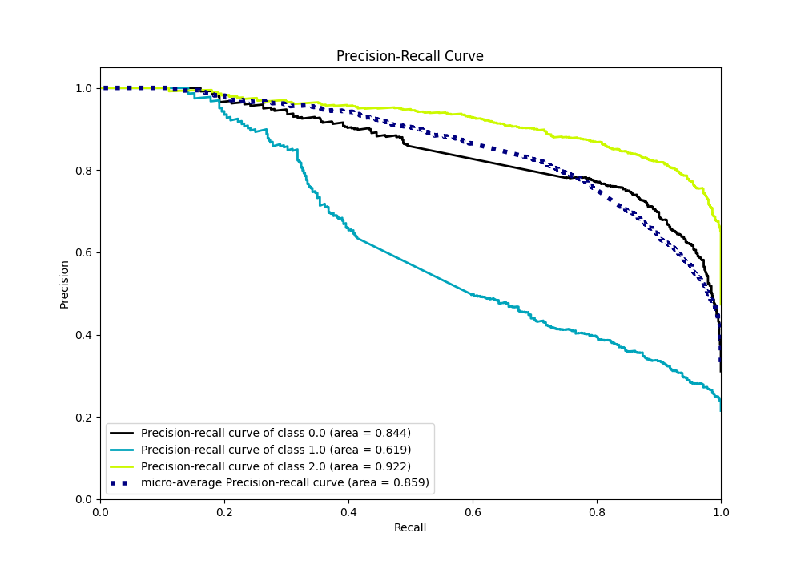

# Summary of Ensemble

[<< Go back](../README.md)

## Ensemble structure
| Model                   |   Weight |
|:------------------------|---------:|
| 4_Default_Xgboost       |        5 |
| 5_Default_NeuralNetwork |        1 |

### Metric details
|           |        0.0 |        1.0 |         2.0 |   accuracy |   macro avg |   weighted avg |   logloss |
|:----------|-----------:|-----------:|------------:|-----------:|------------:|---------------:|----------:|
| precision |   0.736029 |   0.684783 |    0.818558 |   0.772806 |    0.746457 |       0.764102 |  0.539865 |
| recall    |   0.856155 |   0.378    |    0.897366 |   0.772806 |    0.710507 |       0.772806 |  0.539865 |
| f1-score  |   0.79156  |   0.487113 |    0.856153 |   0.772806 |    0.711609 |       0.75666  |  0.539865 |
| support   | 723        | 500        | 1101        |   0.772806 | 2324        |    2324        |  0.539865 |

## Confusion matrix
|                |   Predicted as 0.0 |   Predicted as 1.0 |   Predicted as 2.0 |
|:---------------|-------------------:|-------------------:|-------------------:|
| Labeled as 0.0 |                619 |                 32 |                 72 |
| Labeled as 1.0 |                164 |                189 |                147 |
| Labeled as 2.0 |                 58 |                 55 |                988 |

## Learning curves

## Confusion Matrix

## Normalized Confusion Matrix

## ROC Curve

## Precision Recall Curve

[<< Go back](../README.md)
